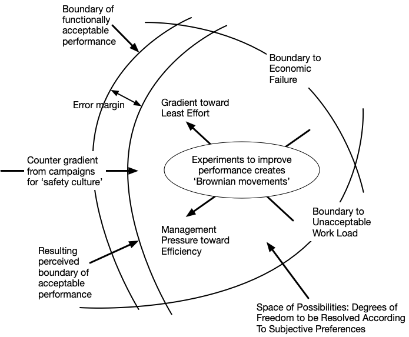

# Resilience engineering: Where do I start?

( *This doc is a work in progress.* ).

This doc is an attempt at an introductory guide to readings in *resilience engineering*, aimed at software engineers. I've tried to organize a few key papers into themes.

## Complex systems

A recurring theme in resilience engineering is about reasoning holistically about *systems*, as opposed to breaking things up into components and reasoning about components separately. This perspective is known as *systems thinking*, which is
a school of thought that has been influential inthe resilience engineering
community.

[How complex systems fail](http://web.mit.edu/2.75/resources/random/How%20Complex%20Systems%20Fail.pdf) by 
Richard I. Cook is a great starting point. It's a short paper and very easy to read.

[Drift into failure](https://www.goodreads.com/book/show/10258783) by Sidney Dekker 
is a book written for a lay audience, so it is also very readable. Dekker draws
heavily from systems thinking to propose a theory about how complex systems
can evolve into unsafe states.

## Changing perspectives on accidents and safety

Resilience engineering as a field emerged from the safety science community.
That's why you'll often see examples from aviation and medicine, as well as
other safety critical areas like maritime, space flight, nuclear power, and rail.

Because of this history, the earlier papers that we associate with resilience
engineering are reactions to previous ways of thinking about accidents in 
particular and safety in general.

Note that traditional approaches to safety often focus on minimizing variance
associated with humans doing work, using techniques such as documented
procedures and enforcement mechanisms for deviating from them. 

For those of us who work on cloud web services, we don't have this legacy of
enforced procedures to contend with.

### New look / new view

The "new look" or "new view" refers to a change in perspective on how accidents
happen, which focuses on understanding how actions taken
by actors involved in the incident were rational, given what information those
actors had at the time that events were unfolding.

[Reconstructing human contributions to accidents: the new view on error and performance](https://www.sciencedirect.com/science/article/pii/S0022437502000324) 
by Dekker is a good place to start here. (Alas, it's paywalled).

### Safety-II

Safety-II is a perspective on the role that humans play in safety-critical 
critical systems, proposed by Erik Hollnagel. In the Safety-II perspective,
it is the everyday, normal work of the humans in the system that create the safety,
as opposed to the errors of humans that erode it.

Hollnagel's [From Safety-I to Safety-II: A White Paper](https://www.skybrary.aero/bookshelf/books/2437.pdf) is a very readable
introduction to Safety-II concepts.

## Automation

One thing we software folk do have in common with the safety-critical world is
the increased adoption of automation. Automation introduces challenges, and
the nature of these challenges is a topic of many resilience engineering papers.

[Ironies of automation](https://doi.org/10.1016/0005-1098(83)90046-8) by Lisanne
Bainbridge is a classic paper on the problems that automation can introduce.
The paper was originally written in 1983, and continues to be widely cited. 

[Ten challenges for making automation a team player](https://ieeexplore.ieee.org/abstract/document/1363742)
by Klein et al. is a more recent paper that outlines the requirements for
automation to be genuinely effective.

## Boundary as a model

### Dynamic safety model (Rasmussen)

The late Jens Rasmussen is an enormously influential figure in the resilience engineering community.

One of Rasmussen's most famous papers is [Risk management in a dynamic society: a modelling problem](https://doi.org/10.1016/S0925-7535(97)00052-0), published in 1997.

In this widely cited paper, Rasmussen advocates for a cross-disciplinary,
systems-based approach to thinking about how accidents occur. He argues that
accidents occur because the system migrates across a dangerous boundary, and
this migration occurs during the course of normal work.

Here is a depiction of the model from that paper:

### Dragons at the boundary (Woods)

David Woods also uses the metaphor of a system moving within a boundary in his writings on resilience engineering, but in
a slightly different way than Rasmussen.

In Woods's view, there are two different regimes of system behavior: far from the boundary and near the boundary.

When a system is far from the boundary, the system (and its environment) behave as expected. By contrast, when a system
grows near to the boundary, surprises happen. Woods uses the metaphor of *dragons* to capture the surprises that occur when a system moves near the boundary, and how the system's model of the world is violated when it enters this regime.

It is how units within a system adapt when the system moves near the boundary, how these units deal with the dragons,
that is one of the prime concerns of Woods. 

[Essentials of Resilience, revisited](https://www.researchgate.net/profile/David_Woods11/publication/330116587_4_Essentials_of_resilience_revisited/links/5c2e448ba6fdccd6b58f871e/4-Essentials-of-resilience-revisited.pdf?origin=publication_detail)

## Coordination

[Common Ground and Coordination in Joint Activity] is an often-cited paper on how people coordinate to perform
tasks together.

[Common Ground and Coordination in Joint Activity]: http://jeffreymbradshaw.net/publications/Common_Ground_Single.pdf

## David Woods

TBD
